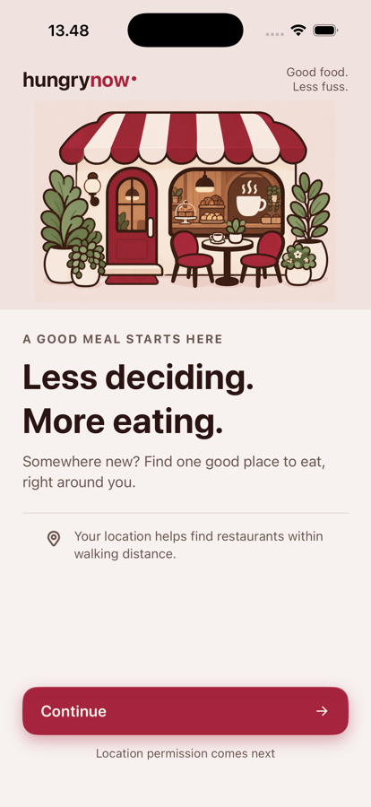
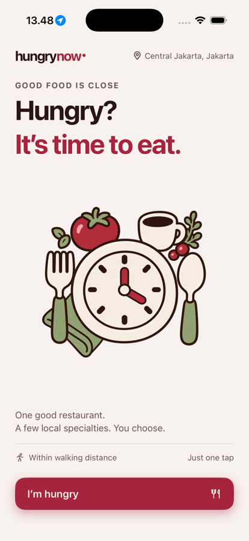
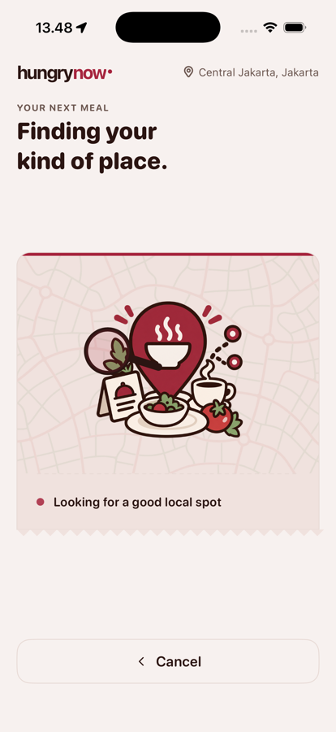
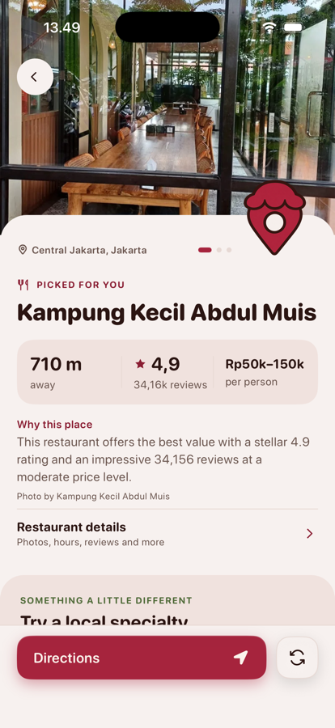
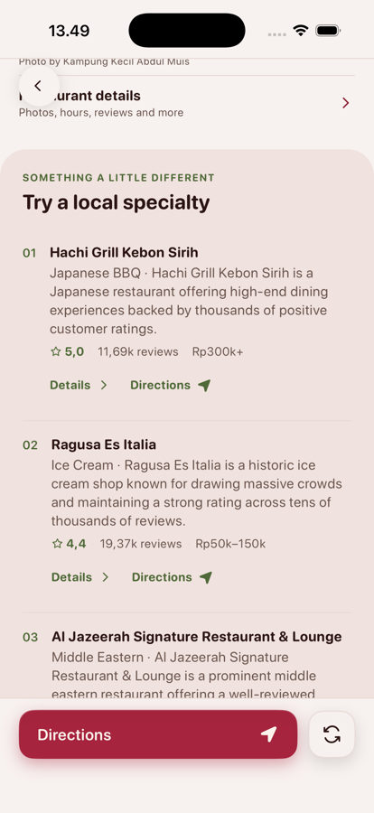
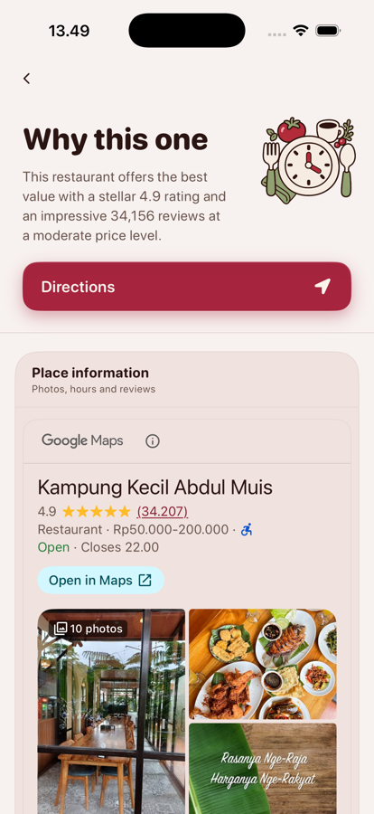

# HungryNow

**One button. One answer. No scrolling.**

An iOS app for the moment you're hungry in an unfamiliar city and every search
returns forty restaurants you know nothing about. HungryNow returns **one**
recommendation — the best-value place open right now, near you, with a one-line
reason — plus two or three places known for a specific local dish.

No login. No search bar. No list of results. It is a decision tool, not a directory.

---

## The whole flow

| | | |
|:---:|:---:|:---:|
|  |  |  |
| **Welcome** — one job: explain why location is needed, before asking | **Home** — the entire interface is one button | **Searching** — honest staging, cancellable |
|  |  |  |
| **The answer** — one place, the three facts you decide on, and why | **Specialties** — 2-3 places, each known for a different dish | **Details** — Google's own listing, no data re-hosted |

Five taps from launch to walking directions. There is no list to scroll, no
filter to set, and no second opinion to weigh.

---

## How it works

```
iPhone                    Firebase Cloud Function            Google
──────                    ───────────────────────            ──────
tap "I'm Hungry"
  └─ CoreLocation ──────► POST /get_recommendation
                            ├─ location cache (48h, ~1km grid)
                            ├─ on miss ──────────────────────► Places Nearby Search
                            ├─ filter to places open NOW
                            └─ one structured call ──────────► Gemini
                          ◄─ hero pick + 2-3 specialties
  ◄─ render
       └─ on photo tap ──► POST /get_photo
                            └─ download once, WebP, store ──► Firebase Storage
                          ◄─ permanent URL + attribution
```

**The API keys never reach the phone.** Gemini and the server-side Places key live
in Firebase Secrets; the client only ever talks to the Cloud Function. That is
also what makes the daily quota caps enforceable — a client-side cap is a
suggestion, a server-side one is a limit.

---

## Architecture

**The one rule:** ViewModels depend only on protocols — `RecommendationServiceProtocol`,
`LocationServiceProtocol`, `NetworkMonitorProtocol` — never on concrete types or
third-party libraries. Views never call a service directly.

That dependency inversion is the point of the project, not incidental style: the
networking layer, the location source, and the AI provider can each be swapped
without touching UI or business logic.

```
hungrynow/
├── App/           RootView — a route enum, so a new screen costs one case
├── Features/      Welcome, Recommendation (Views + ViewModel)
├── Services/      LocationService, NetworkMonitor, RecommendationService
│                  — each behind a protocol, each independently replaceable
├── Models/        RecommendationResponse, HeroPick, SpecialtyPick, …
└── Core/          Theme, formatters, transitions, shared components
```

**Networking is one enum.** Every endpoint is a case of a
[Moya](https://github.com/Moya/Moya) `TargetType`, so the whole HTTP surface is
declared in one file and the ViewModel never sees a URL, a header, or a
`URLSession`:

```swift
enum RecommendationAPI {
    case getRecommendation(latitude: Double, longitude: Double)
    case getPhoto(photoRef: String, attribution: String?)
}
```

Moya was chosen over a bespoke client deliberately — it is a convention both a
new developer and an AI agent already recognise, rather than a layer they have to
reverse-engineer. Swapping it out means rewriting `RecommendationService`, and
nothing above it.

**Client:** SwiftUI (iOS 16+), MVVM, Moya over Alamofire, RxSwift in the service
layer, [Lottie](https://github.com/airbnb/lottie-ios) for the search animation.

**Backend:** Python 3.11 on Firebase Cloud Functions (2nd gen), Firestore for
caching, Firebase Storage for re-hosted photos, `google-genai` for Gemini. The
client is deliberately ignorant of all of it — it knows one base URL and two
endpoints, so the entire backend could be replaced without touching the app.

---

## Things that were harder than they look

Small decisions that shaped the app, written up in full in [`docs/brain/`](docs/brain/).

**Only recommend places that are actually open.** A closed restaurant makes the
whole recommendation worthless. Google's `openNow` is a snapshot, and the
candidate list is cached for 48 hours — so open/closed is evaluated at *query*
time from each restaurant's `periods` and UTC offset, handling overnight hours
and schedules that wrap past Sunday midnight. Warungs with no listed hours are
kept when open options are scarce, rather than being silently dropped.

**Photos are downloaded once, ever.** `get_photo` fetches the image, compresses
it to WebP, uploads it to Firebase Storage, and returns a permanent URL of our
own. Google is never asked for that photo again. Each photo also carries its
author credit, which Google requires be displayed.

**Two independent quota walls.** Places and photo fetches have separate daily
counters, and both checks sit *inside* the cache-miss branch — a cache hit costs
nothing. When the day's recommendations are gone the app says so plainly and
**removes** the retry button, because a button that cannot succeed is worse than
no button.

**The prompt pays for every character.** Candidate photo references are ~240
characters of opaque identifier each and were 43% of the prompt — tokens spent on
a string the model cannot reason about. They now travel as integer ids resolved
server-side, cutting the prompt 45% with no change to the response.

---

## Running it

**1 — Deploy your own backend.** The client has no API keys of its own; it calls
a Cloud Function that holds them.

```bash
cd firebase
firebase use --add                    # select your own Firebase project
firebase functions:secrets:set GEMINI_API_KEY
firebase functions:secrets:set PLACES_API_KEY
firebase deploy --only functions
```

**2 — Point the app at it.** The base URL is currently hardcoded in
[`RecommendationAPI.swift`](hungrynow/Services/RecommendationService/RecommendationAPI.swift):

```swift
var baseURL: URL {
    URL(string: "https://us-central1-revaiter-hungrynow.cloudfunctions.net")!
}
```

Replace it with the URL the deploy printed — otherwise the app calls *this*
project's backend, against its quota rather than yours.

**3 — Add the client Places key.**

```bash
cp Config/Secrets.xcconfig.example Config/Secrets.xcconfig
open hungrynow.xcodeproj
```

`Config/Secrets.xcconfig` is gitignored and holds only the client-side,
bundle-restricted Places key used by the Place Details screen. The server keys
never leave Firebase Secrets.

```bash
# Tests
xcodebuild -project hungrynow.xcodeproj -scheme hungrynow \
  -destination 'platform=iOS Simulator,name=iPhone 17' test
```

---

## `docs/brain/` — why the reasoning ships with the code

Most repos record what the code does. This one also records **why**, and what was
rejected: an Obsidian-style vault with a chronological decision log, per-service
pages, the visual identity spec, and the API contract.

It is in the repo rather than a wiki so an AI coding agent — or a new developer —
can read the reasoning next to the code it explains. Start at
[`docs/brain/checklist.md`](docs/brain/checklist.md) for current state, then
[`docs/brain/wiki/log.md`](docs/brain/wiki/log.md).

---

## Status

Functionally complete and deployed; all nine screens built. Remaining work is
verification and polish — see the checklist. Built by
[Sadri Ashari](https://github.com/Sadri21) under the **Revaiter** brand.
